### 深度网络的退化问题
从经验来看，网络的深度对模型的性能至关重要，当增加网络层数后，网络可以进行更加复杂的特征模式的提取，所以当模型更深时理论上可以取得更好的结果，从下图中也可以看出网络越深而效果越好的一个实践证据。但是更深的网络其性能一定会更好吗？实验发现深度网络出现了退化问题（Degradation problem）：网络深度增加时，网络准确度出现饱和，甚至出现下降。这个现象可以在图3中直观看出来：56层的网络比20层网络效果还要差。这不会是过拟合问题，因为56层网络的训练误差同样高。我们知道深层网络存在着梯度消失或者爆炸的问题，这使得深度学习模型很难训练。但是现在已经存在一些技术手段如BatchNorm来缓解这个问题。因此，出现深度网络的退化问题是非常令人诧异的。  
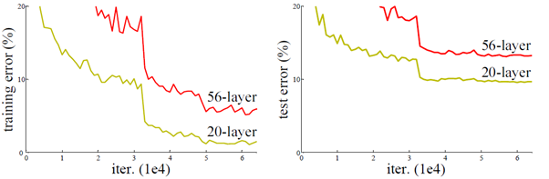  
### 残差学习
深度网络的退化问题至少说明深度网络不容易训练。但是我们考虑这样一个事实：现在你有一个浅层网络，你想通过向上堆积新层来建立深层网络，一个极端情况是这些增加的层什么也不学习，仅仅复制浅层网络的特征，即这样新层是恒等映射（Identity mapping）。在这种情况下，深层网络应该至少和浅层网络性能一样，也不应该出现退化现象。好吧，你不得不承认肯定是目前的训练方法有问题，才使得深层网络很难去找到一个好的参数。  
这个有趣的假设让何博士灵感爆发，他提出了残差学习来解决退化问题。对于一个堆积层结构（几层堆积而成）当输入为x时其学习到的特征记为H(x) ，现在我们希望其可以学习到残差F(x)=H(x)-x ，这样其实原始的学习特征是F(x)+x 。之所以这样是因为残差学习相比原始特征直接学习更容易。当残差为0时，此时堆积层仅仅做了恒等映射，至少网络性能不会下降，实际上残差不会为0，这也会使得堆积层在输入特征基础上学习到新的特征，从而拥有更好的性能。残差学习的结构如图4所示。这有点类似与电路中的“短路”，所以是一种短路连接（shortcut connection）。  
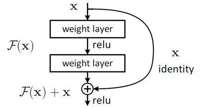   
为什么残差学习相对更容易，从直观上看残差学习需要学习的内容少，因为残差一般会比较小，学习难度小点。不过我们可以从数学的角度来分析这个问题，首先残差单元可以表示为：  
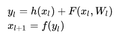  
基于上式，我们求得从浅层 l到深层L的学习特征为：  
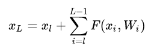  
利用链式规则，可以求得反向过程的梯度：  
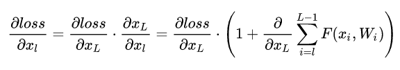   
式子的第一个因子表示的损失函数到达L的梯度，小括号中的1表明短路机制可以无损地传播梯度，而另外一项残差梯度则需要经过带有weights的层，梯度不是直接传递过来的。残差梯度不会那么巧全为-1，而且就算其比较小，有1的存在也不会导致梯度消失。所以残差学习会更容易。要注意上面的推导并不是严格的证明。
### ResNet网络结构
ResNet网络是参考了VGG19网络，在其基础上进行了修改，并通过短路机制加入了残差单元,变化主要体现在ResNet直接使用stride=2的卷积做下采样，并且用global average pool层替换了全连接层。  
ResNet的一个重要设计原则是：当feature map大小降低一半时，feature map的数量增加一倍，这保持了网络层的复杂度。从图5中可以看到，ResNet相比普通网络每两层间增加了短路机制，这就形成了残差学习，其中虚线表示feature map数量发生了改变。  
下图展示的34-layer的ResNet，还可以构建更深的网络如表所示。从表中可以看到，对于18-layer和34-layer的ResNet，其进行的两层间的残差学习，当网络更深时，其进行的是三层间的残差学习，三层卷积核分别是1x1，3x3和1x1，一个值得注意的是隐含层的feature map数量是比较小的，并且是输出feature map数量的1/4。  
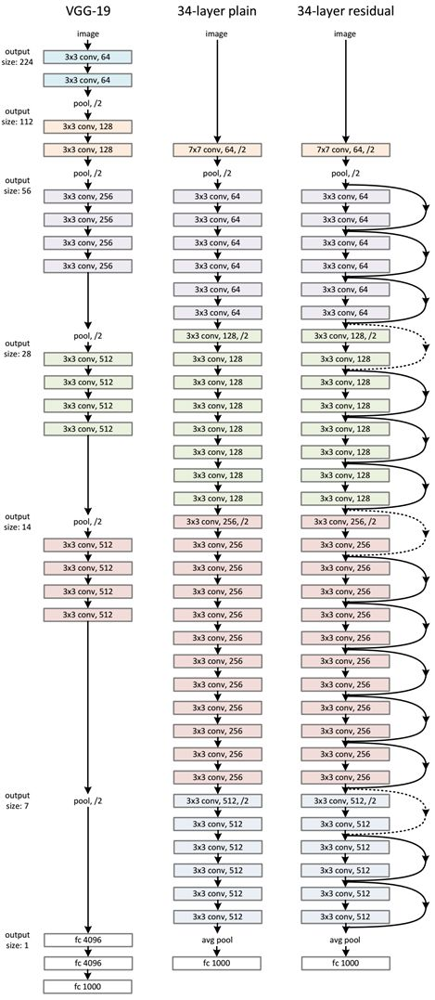  
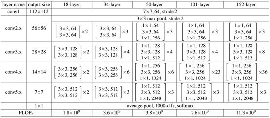  
下面我们再分析一下残差单元，ResNet使用两种残差单元，分别为浅层网络和深层网络。对于短路连接，当输入和输出维度一致时，可以直接将输入加到输出上。但是当维度不一致时（对应的是维度增加一倍），这就不能直接相加。有两种策略：  
（1）采用zero-padding增加维度，此时一般要先做一个downsamp，可以采用strde=2的pooling，这样不会增加参数；  
（2）采用新的映射（projection shortcut），一般采用1x1的卷积，这样会增加参数，也会增加计算量。短路连接除了直接使用恒等映射，当然都可以采用projection shortcut。  
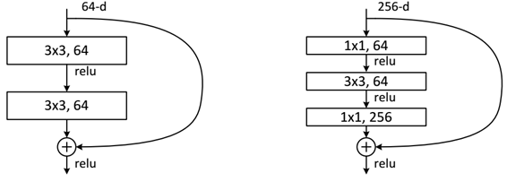  
作者对比18-layer和34-layer的网络效果，如图7所示。可以看到普通的网络出现退化现象，但是ResNet很好的解决了退化问题。  
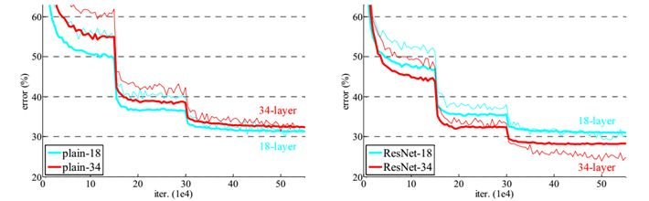  
最后展示一下ResNet网络与其他网络在ImageNet上的对比结果，如表2所示。可以看到ResNet-152其误差降到了4.49%，当采用集成模型后，误差可以降到3.57%。  
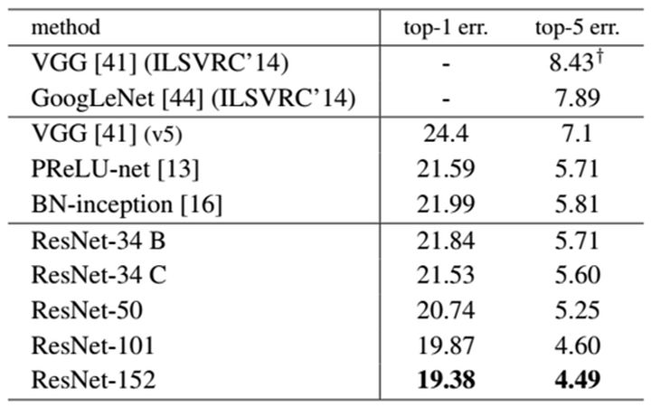  
说一点关于残差单元题外话，上面我们说到了短路连接的几种处理方式，其实作者在文献[2]中又对不同的残差单元做了细致的分析与实验，这里我们直接抛出最优的残差结构，如图8所示。改进前后一个明显的变化是采用pre-activation，BN和ReLU都提前了。而且作者推荐短路连接采用恒等变换，这样保证短路连接不会有阻碍。感兴趣的可以去读读这篇文章。  
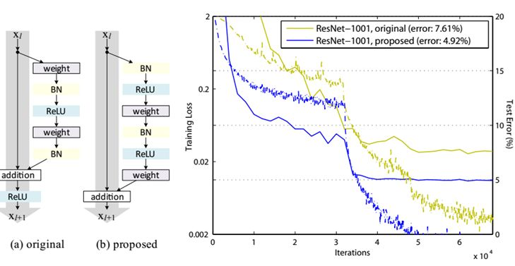
### 参考资料
1. Deep Residual Learning for Image Recognition.
2. Identity Mappings in Deep Residual Networks.
